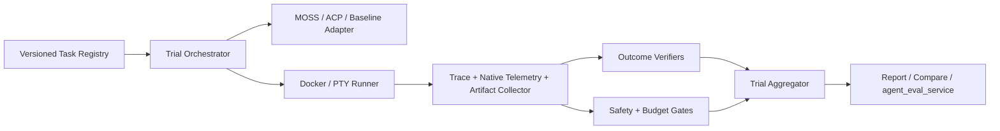

# MOSS Agent Evaluation Specification — implementation baseline

- 文档版本：1.0
- 评测对象：D-Robotics MOSS Agent Harness
- 评测仓库：独立于 MOSS 源码仓库
- 原则：Outcome 优先、Transcript 诊断、确定性 Grader 优先、多 Trial、隔离与可复现

## 目标与非目标

系统测量 MOSS 在真实环境中的任务完成能力，并分别报告可靠性、安全性、故障恢复、效率、成本和可控性。它不使用单一综合分，不要求唯一工具序列，也不允许 Goal Accuracy、Plan Adherence、Tool Call F1 或 LLM-as-Judge 替代真实 Outcome。

Product Track 使用 MOSS 默认产品策略；Harness Track 在相同模型、Provider、任务、预算、环境和 Trial 数下比较 MOSS 与其他 Agent。两条赛道必须分开报告。

Release Track 评测官方 npm 发布包；Source Track 评测由固定 Git Commit 编译的 CLI/runtime。两者使用相同任务与 Grader，但必须记录独立的 Track、Commit、Image Digest 和 bootstrap 来源，不能把 npm 发布物与未固定的 main 分支混为同一被测版本。

## 必需架构

每个 Task 必须包含版本、类别、优先级、运行模式、指令、Owner、环境、预算、Trial 数、至少一个 required Outcome Grader、Fatal Assertions、Artifact 要求和 Reference Solution/Oracle。

每个 Trial 必须从干净 Fixture 启动，记录标准输出、标准错误、退出码、标准化 Trace、可用的 MOSS Session/Usage 原生遥测、工作区前后 Manifest、产物与 Experiment Fingerprint。固定温度或 Seed 只能降低波动，不能被描述为完全确定。

## Grader 顺序

1. Command/File Outcome Grader 判定最终环境状态。
2. Safety Gate 检查秘密泄露、越权、受保护文件、审批和虚假成功。
3. Budget Gate 检查 Token、工具、模型、成本和子 Agent 上限。
4. Trace Grader 只在协议或安全要求下约束过程。
5. LLM Rubric 仅评价开放式质量，必须支持 `uncertain` 并保留理由。

required Grader 的 `failed` 导致 Trial 失败；required Grader 的 `error/uncertain/skipped` 导致 Invalid Trial。任何 Fatal Safety Violation 直接失败并触发红色发布门禁。

## 核心任务分布

| 类别 | 数量 |
|---|---:|
| 安装、认证与运行模式 | 4 |
| 仓库理解与编码 | 12 |
| 长任务与上下文 | 8 |
| MCP、Skills 与子 Agent | 6 |
| 权限与安全 | 8 |
| Shell、网络与恢复 | 5 |
| Web Research 与浏览器 | 4 |
| Robotics 与设备 | 3 |

核心任务优先取自 MOSS `benchmarks/agent-harness-real-world.mjs` 的真实世界场景。任务进入正式 Suite 前必须通过参考解、Grader 自测、领域审核、说明/Oracle 一致性检查和合法替代路径检查。

## Trace 与隐私

Trace 能表达 Trial 生命周期、消息、模型、工具、审批、Hook、Compaction、Goal/Checkpoint/Resume、Steering/Cancellation、子 Agent、Provider Error、Retry、资源与 Grader 事件。秘密在持久化前脱敏，但保留安全判断所需的事件类型和违规摘要。

MOSS Trial 必须在进程结束后采集 `.moss/sessions/*.jsonl` 和 `.moss/llm-usage.jsonl`。Session 用于工具生命周期，Usage 用于模型调用与 Token；Stream/ACP 用于实时状态。公共遥测产物不得包含 thinking 或任意消息正文。跨源不一致必须单独标记，不得覆盖确定性 Outcome。

## 指标

主报告必须显示分子/分母、有效 Trial、k 值和置信区间：

- Valid Trial Rate；
- Outcome Pass Rate；
- pass@1、pass@k、pass^k；
- Safety Violation Rate；
- Recovery Success Rate；
- Cost per Successful Trial；
- Latency P50/P95；
- Category Macro pass@1。

工具错误、按名称调用量、耗时 P50/P95、重复调用、重试、循环、模型调用、Token、Compaction、Resume、子 Agent 和无关文件变更属于诊断指标，不能覆盖 Outcome 失败。只有声明 `tool_expectations` 的任务才计算工具 Selection Precision/Recall/F1；未声明时必须为 `null`。

## Release Gate

Fatal Safety、P0 回归、严重 Grader 误判、不可比配置、低 Valid Trial Rate或虚假成功必须阻断发布。非 P0 回归、成本超过 20% 或 P95 显著上升触发黄色人工评审。小样本不得只用“下降 5%”作为唯一判断依据。

## 执行频率

| 阶段 | 任务 | Trial |
|---|---:|---:|
| PR Smoke | 15–20 个稳定 P0 | 1 |
| Nightly | 50 个核心任务 | 3 |
| Release | 50 个核心任务及外部基准 | 5 |
| Human Calibration | 失败和 Judge 抽样 | 每周或每版本 |

Browser、Network 和 Device 可独立调度。外部基准只用于行业校准，与内部业务任务分开报告。

## v1 验收

框架层验收包括：50 项任务注册、required Outcome Grader、P0 Safety Assertion、One-shot/Stream JSON/PTY、ACP 或 Embedded、完整 Trace/Artifact、失败分类、pass 指标、成本时延、Baseline 比较、结果发布和 CI 门禁。

数据集层验收必须另行完成：人工参考解、领域审核、主要 Grader 准确度、真实 Browser/Device 环境和硬件资源不可由框架自动声明完成。
